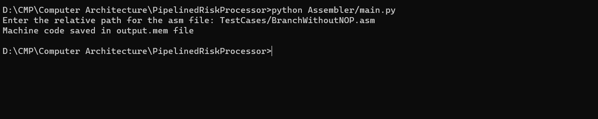

# Pipelined Risc Processor

## Project Description

This is a 5 staged pipelined microprocessor, implemented in VHDL language.
The processor follows harvard architecture i.e. Data and instruction caches are separated.
Th processor follows a RISC-like instruction set architecture.
ModelSim was used to simulate the execution of the program.

## Processor Default Specifications

- The data cache address space is 1 MB of 16-bit width and is word addressable. (Note: word = 2 bytes).
- There are eight 2-byte general purpose registers; R0, till R7.
- There are three special purpose registers
  - Program counter (PC).
  - Exception program counter (EPC).
  - Stack pointer (SP).
- The initial value of SP is (2^20-1).
- This project handles two types of exceptions
  - Empty Stack Exception which occurs when a pop is called while the stack is empty.
  - Invalid memory address which occurs when the address exceeds the range of 0xFF00.
- The exception handler address for empty stack exception is stored in the instruction cache in locations M[2] and M[3].
- The exception handler address for invalid mem address exception is stored in the instruction cache in locations M[4] and M[5].
- When an exception occurs, the address of the instruction causing the exception is saved in the exception program counter (EPC).
- There are 3 flags; implemented in a condition code register named flags<3:0>
  - Zero flag, flags<0>, which changes after arithmetic, logical, or shift operations.
  - Negative flag, flags<1>, which changes after arithmetic, logical, or shift operations
  - Carry flag, flags<2>, which changes after arithmetic or shift operations.
- There is one input port named that takes a value from the port and write it in a register.
- There is one output port that takes a value from a register and out it to the port.
- There is a Reset signal named reset in the integration.vhd

## Processor Architecture

### Processor Schematic


[Detailed schematic](https://drive.google.com/file/d/1zuHKoJMy6AUCvIne_Lm-175phOYGpQu8/view)
[Signals truth table](https://docs.google.com/spreadsheets/d/1lr_N0lB1HSywKzcrYZ6tmSOCiAKztsoX7s7VOZc_qas/edit)
[Instruction formats and OpCodes](https://docs.google.com/document/d/1ouRm3oqg-eWnROHxTDpU_5tlnD7pdVMgx7yQYFhWJKY/edit)

## How to use the project

### Converting the assembly program to machine code

- Run the main.py to generate the machine code corresponding to the assembly program. The program will ask you to enter the relative path for your assemble file.The machine code instructions will be stored in a file named 'output.mem'



### Executing and Simulating the program in ModelSim

- Create a project in ModelSim.
- Add to the project all .vhd files attached with the repo.
- Compile order and choose auto generate to generate a correct dependency sequence of compilation between vhdl files.
- Compile all .vhd files.
- Copy to the project directory the output.mem file. Then add it to the project.
- Copy your do file to the project directory then add it to project.
- Include at the start of your do file the following line to start simulation

```
vsim -gui work.integration
```

- Include at the start of the do file the following line to load the instruction memory with the programs' machine code.

```
mem load -infile output.mem -format bin /integration/fetch_stahe/Memory/ram
```

- Run your do file in modelsim's transcript with the following line

```
>>> do filename.do
```

- To fire the reset signal run the following line in the transcript

```
>>> force -freeze sim:/integration/reset 1 0
```

- To put a value on the Input port, you should forced in simulation before the fetch stage of the input port instruction.

### Processor Configurations

- config_system.vhd file holds some of the processors specifications. To change any specification, change it in this file.
